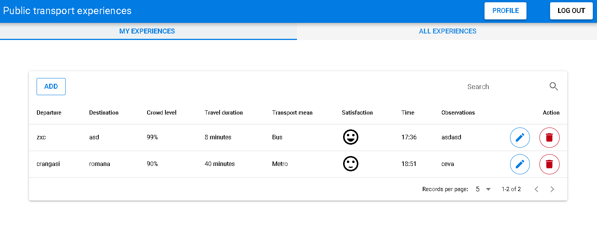

# Experienta mijloacelor de transport in comun


## Introducere

Text de adaugat

## Descriere problema

Text de adaugat

## Descriere API

Text de adaugat

## Flux de date


POST: /api/experiences

```json
Request body:

{
  "start":"crangasi",
  "end":"romana",
  "transportMean":"Metro",
  "time":"18:51",
  "travelDuration":"40",
  "crowdLevel":90,
  "observation":"ceva",
  "satisfaction":"sentiment_satisfied"
 }

Response body:
{ 
    "message": "Experience was sucessfull created"
}

```

GET: /api/logout

```json
Response body:
{ 
   "message": "Successful logout"
}

```


### Metode HTTP

| Verb HTTP | Cale                 | Descriere                                   |
| --------- | -------------------- | ------------------------------------------- |
| GET       | /api/reset           | reseteaza baza de date                      |
| POST      | /api/register        | adauga un nou utilizator al aplicatiei      |
| POST      | /api/login           | autentifica utilizator existent             |
| GET       | /api/logout          | dezautentifica utilizator autentificat      |
| PUT       | /api/user            | modifica date utilizator autentificat       |
| DELETE    | /api/user            | sterge utilizator autentificat              |
| GET       | /api/experiences     | reda experiente utilizator autentificat     |
| GET       | /api/experiences/all | reda experiente toti utilizatorii           |
| DELETE    | /api/experiences     | sterge experienta utilizator autentificat   |
| PUT       | /api/experiences     | modifica experienta utilizator autentificat |
| POST      | /api/experiences     | adauga experienta utilizator autentificat   |


### Autentificare si autorizare servicii

Pentru autentificare am folosit sesiuni de client stocate in cookie.

Singurele endpoint-uri ce pot fi folosite fara ca utilizatorul sa fie autentificat sunt **register** si **login**, pentru restul fiind necesar ca utilizator sa fie autentificat. 

## Capturi ecran aplicatie



## Referinte

